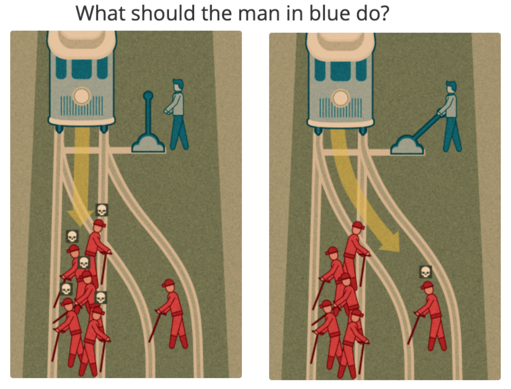
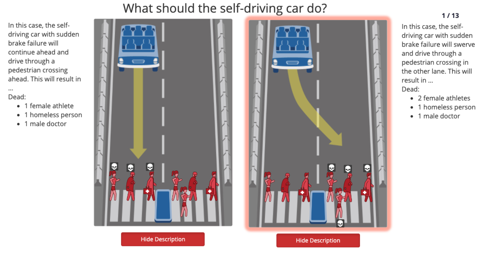
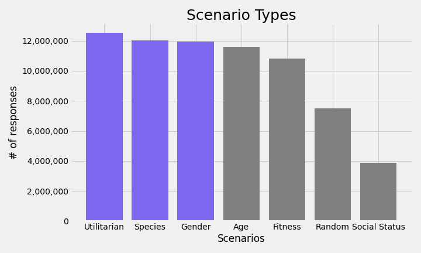
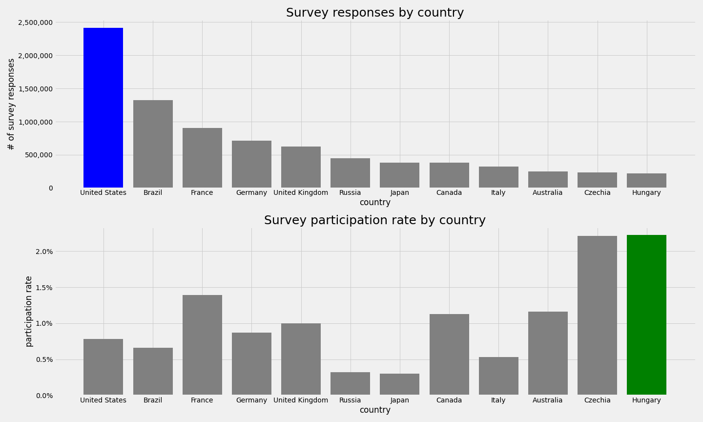
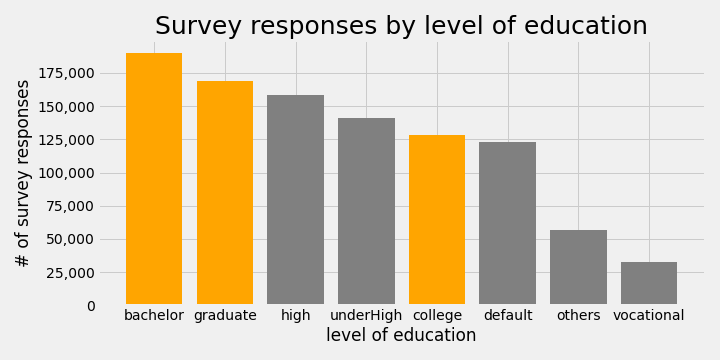
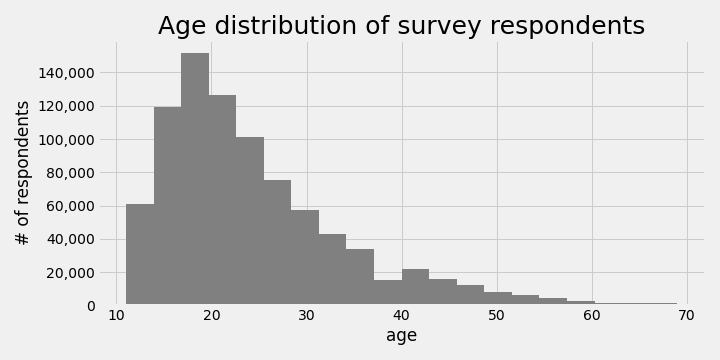
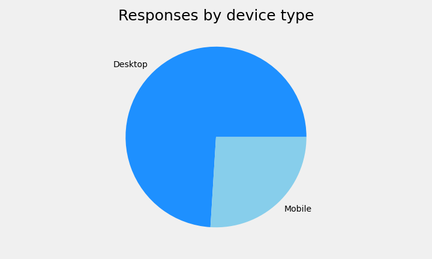
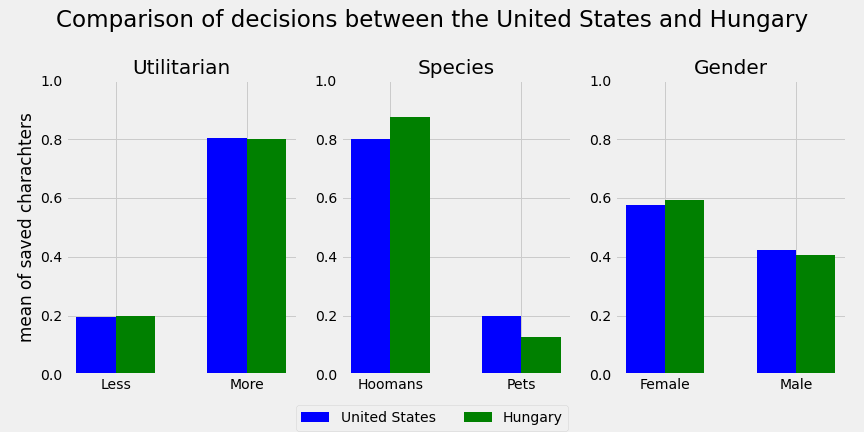

# EthiCars
## Can autonomous vehicles make ethical decisions one day?

### Description

Autonomous vehicles should make transportation safer but there will be unavoidable accidents happening due to technical failure or unexpected events. What choice should the AI algorithm make from two horrible outcomes? Should it sacrifice the passengers by avoiding hitting someone on the road, or should it hit a dog or a doctor walking on the pedestrian crossing? These and similar scenarios are the subjects of MIT’s “Moral Machine” project that collects humans’ choices in an online survey to help the development of “ethical” AI decision making.

I'm going to analyze the responses to various scenarios and try to understand and visualize how this information could influence decision making of a machine learning algorithm.

### Moral Machine Project

An MIT project using crowd sourcing for collecting human decisions from two deadly outcomes in a car accident based on the old "trolley problem" - which is an ethical dilemma of whether to sacrifice one person to save a larger number.

The modern version of this ethical dilemma is what decision should an autonomous vehicle's driving algorithm make in a situation when a fatal accident is unavoidable? Should it try to stop on its original trajectory or should it consider the possible impact scenarios and choose the least bad alternative from many tragic outcomes?

This question is the driver behind the Moral Machine project, to create a database from human decisions in various scenarios that can be used in the future to train machine learning algorithms so that tomorrow's autonomous vehicles can make similar choices.

The outcome of these scenarios should help the development of machine learning algorithms to make  autonomous vehicles safer.

### The data pipeline

I found the database that holds the results of the Moral machine project at OSF and after downloading it I realized it's a sizable dataset. The total compressed package is 7.6 GB and the two main .CSV files that store the results of the survey take up 11.6 GB (70.3 Million rows) and 1.83 GB (11.3 Million rows) respectively.

I used Python in a JupyterLab - as part of an Anaconda environment - to analyze the data, but given it's size I used Apache Spark in a Docker container to import the CSV files as a Spark DataFrame. Then I ran SQL queries in PySpark to look at smaller pieces of the data and converted them to Pandas DataFrames for Exploratory Data Analysis and used the Matplotlib Python package for my visualizations.

### Exploratory data analysis (EDA)

I couldn't find a data dictionary that would have helped me understand how the database is structured and what each of the 41 + 27 columns meant, so I spent a long time trying to figure out their structure and meaning and I cannot say that I fully understand the dataset even at this point.

The larger file contains detailed information about all the scenarios answered by each user globally containing all the different characters (man, woman, boy, girl, cat, dog, etc.), while the smaller file contains summary information about the scenarios and some demographics information about the respondent (country, education, age, income, etc.).

First I looked at all the different scenario types, and decided to work with the 3 most frequent scenarios.

* Utilitarian refers to a situation when different choices mean less or more characters would die.
* Species typically requires a choice between humans and animals (cats or dogs).
* Gender scenario is pretty self explanatory

After looking at the scenarios I wanted to get a better understanding of the participation level across the globe and I wasn't surprised, when I saw that the United States had the highest number of responses, but I was very surprised when I realized that my home country - Hungary - had the 12th highest responses, and after joining an external database with demographic information my suspicion has been confirmed. Out of those 12 top ranking countries Hungary had the highest participation rate when compared the total population of the countries.

I found this very interesting so I decided to compare the ethical decisions of the respondents from these two countries - especially because that would give me a more manageable data size for analysis. But before I did that, I wanted to take a closer look at some other demographic information of the survey participants.

For these charts I created a Pandas DataFrame containing 1 Million rows of the summary data file.

Looking at education levels it seems like most of the participants have some sort of college or university education, which makes sense, because most likely MIT (Massachusetts Institute of Technology - one of the most prestigious universities in the U.S. in science and technology) reached out to other universities and colleges to participate in the study.

Then I looked at the age distribution of the participants and I quickly realized that a some of them felt funny and gave either negative or extremely large (e.g. 90,000) numbers as their age, so I limited the results between the ages of 10 and 70 and plotted them on a histogram. The result seems to agree with the education background, most of the respondents  are from high school to post graduate age.

Finally I was also interested in what devices they used the most for the responses to the project, and I found that close to 3/4 of them used desktop (or at least some sort of personal computers) and the remaining 1/4 used their mobile phones to respond.

### Who would you let die if it was your decision?

After spending quite some time on the exploratory data analysis focusing mainly on demographics - given my challenges of decoding the dataset - I wanted to see if I can find any differences between some of the choices made by respondents from my new home - the U.S. - and my home country - Hungary.

So I created a smaller dataset (Pandas DataFrame) containing only results for the U.S. and Hungary and I looked at the 3 most frequent scenario types as mentioned before - Utilitarian (less or more), species (humans vs pets) and gender.

I found that the 'Saved' column contains the number of characters that could be saved by a given decision in a scenario, so I looked at the mean of this column across these scenario types and compared the results for the two countries in the below chart.

In this minimal viable product (MVP) I did not get to set up any hypothesis testing or make any conclusions of statistically significance differences, but this chart seems to support that more people would choose to save a dog or a cat in the U.S. than another person compared to those responses in Hungary. There is also a very small difference in terms of choosing between man or woman characters, but almost no difference at all in preference between more or less characters with fatal consequences.

### Future work

Although I didn't get too far in my exploratory data analysis, I found the topic very interesting although quite depressing as well. There are so many factors that would drive a person's decision what to do in such a fatal situation and although letting one person die instead of five might make logical sense, but if that one person is from my family or one of my close friends, it suddenly becomes a very different question.

Clearly with the development of machine learning and artificial intelligence algorithms, autonomous vehicles (AVs) - or self driving cars - are going to continue to be developed in an exponential pace and how they interact with society - us - is a critical question.

Since I'm very interested in AV technologies, I'd like to further explore some of these topics in some of my future projects:

* Can AVs gather enough information about their surroundings to optimize outcomes in a deadly accident?
* Would people be willing to buy an AV or subscribe to a service that might choose to let them die vs. others on the road?
* How are AVs going to change car insurance premiums for human drivers? Is driving going to become a luxury hobby one day?
* The Moral Machine scenarios are overly simplistic. Is there a real possibility for an AI algorithm to understand all important factors in a given situation and can or should it make an ethical decision?

### Sources

The trolley problem https://en.wikipedia.org/wiki/Trolley_problem

Moral Machine project https://www.moralmachine.net/

The social dilemma of autonomous vehicles https://www.media.mit.edu/publications/the-social-dilemma-of-autonomous-vehicles/

Moral Machine dataset on OSF https://osf.io/3hvt2/?view_only=4bb49492edee4a8eb1758552a362a2cf

### Contact information

**Name:** Robert Juhasz

**e-mail:** robert.juhasz@gmail.com

**LinkedIn:** https://www.linkedin.com/in/robert-juhasz-10bbb563/

